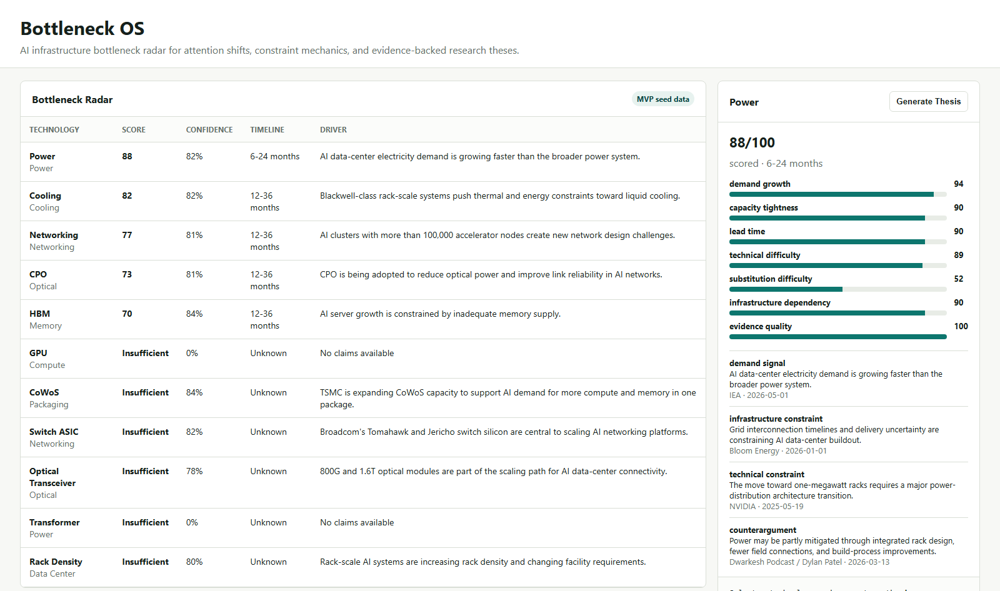

# Bottleneck OS

[English](README.md) | [中文](README.zh-CN.md)

**在市场形成共识之前，识别近期和正在形成的 AI 基础设施瓶颈。**

Bottleneck OS 是一个开源 AI 基础设施情报平台，用来发现还没有成为市场共识的技术瓶颈。

它使用 LLM 从 SEC 文件、政府报告、财报材料和行业新闻中提取证据，持续评估 GPU、HBM 高带宽内存、数据中心电力、网络、散热、CoWoS 先进封装、CPO 共同封装光学等方向的约束。

这个项目把公开证据转化成一张可追溯的瓶颈雷达，可用于 AI infrastructure 研究、GPU supply chain 分析、AI investment research、equity research、financial analysis、investment thesis、alternative data、evidence extraction、market intelligence 和 knowledge graph 工作流。

| 功能 | 状态 |
|---|---|
| 证据抓取 | 已支持 |
| LLM claim 提取 | 已支持 |
| 瓶颈雷达 | 已支持 |
| Web UI | 已支持 |
| 历史趋势 | 已支持 |
| JSON API | 已支持 |
| 证据追溯审计 | 已支持 |

## 预览



数据完整性和证据追溯标准见 [EVIDENCE.md](EVIDENCE.md)。

这个研究流程的灵感来自 Serenity 的 evidence-first research method：先从公开一手资料出发，保留证据链，并把“已经知道的事实”和“仍然缺覆盖的地方”分开。

---

## 追踪什么

Bottleneck OS 目前追踪 11 个核心技术方向：

| 技术 | 类别 | 可能限制什么 |
|---|---|---|
| HBM 高带宽内存 | Memory | GPU 内存带宽、模型规模和吞吐 |
| Networking / InfiniBand | Interconnect | GPU 集群扩展能力 |
| CPO 共同封装光学 | Interconnect | 下一代数据中心带宽和能效 |
| Power Infrastructure | Power | 数据中心建设、电网接入和供电能力 |
| Cooling Systems | Thermal | 高功率机柜散热和液冷改造 |
| GPU | Compute | 直接 AI 算力供应 |
| CoWoS 先进封装 | Packaging | GPU + HBM 的封装产能 |
| Switch ASIC | Networking | AI 集群交换网络 |
| Optical Transceiver | Interconnect | 800G / 1.6T 光模块供应 |
| Transformer 变压器 | Power | 变电站交付和长周期电力设备 |
| Rack Density | Infrastructure | 单机柜功率密度和机房承载能力 |

---

## 工作方式

```text
公开资料                         证据流水线                         输出
────────                         ─────────                         ────
SEC EDGAR 文件      ┐
EIA / DOE 报告      ├─► 抓取 ─► LLM 提取 ─► 打分 ─► Bottleneck Radar
行业研究和公司资料  ┘             claim 类型       0-100 分        API / 报告 / 网页
```

每条证据会被分类为：

- `demand_signal`：需求增长信号
- `capacity_signal`：产能紧张、供给不足或爬坡约束
- `technical_constraint`：技术、架构、带宽、热管理等约束
- `infrastructure_constraint`：电网、许可、建设周期、基础设施约束
- `substitution_signal`：可能缓解瓶颈的替代方案
- `counterargument`：反方证据或不确定性

只有当一个技术方向有足够证据时，系统才会给出 bottleneck score。证据不足的技术会显示为 `insufficient_evidence`。

---

## 安装和运行

需要 Python 3.10 或更高版本。

开发安装：

```powershell
pip install -e ".[dev]"
```

如果要使用 OpenAI 或 Anthropic 做 LLM 提取：

```powershell
pip install -e ".[llm]"
```

复制 `.env.example` 为 `.env`，然后填入 API key：

```text
OPENAI_API_KEY=sk-proj-...
# 或
ANTHROPIC_API_KEY=sk-ant-...
```

`.env` 已经被 `.gitignore` 忽略，不应该提交到 GitHub。

启动本地 API 和网页：

```powershell
py -m bottleneck_os --host 127.0.0.1 --port 8000
```

打开：

```text
http://127.0.0.1:8000
```

---

## 抓取真实公开资料

默认 RSS/API 来源配置在 `sources/feeds.txt`，包括 SEC EDGAR、EIA、DOE 和公开公司来源。

```powershell
py scripts/fetch_feeds.py --feeds sources/feeds.txt --archive-dir archive/sources
py scripts/extract_claims.py --source-dir archive/sources --llm --auto-accept
```

如果只想用一组真实公开 URL，可以用：

```powershell
py scripts/fetch_sources.py --manifest sources/manifest.real.txt --archive-dir archive/sources
```

---

## 人工审核流程

LLM 提取出来的 claim 只是草稿，不应该直接当成最终事实。正式报告建议先走 review：

```powershell
py scripts/extract_claims.py --source-dir archive/sources --llm --review-dir review/current
```

然后检查 `review/current/claims.jsonl`，把每条 claim 的 `review_status` 改成：

- `accepted`
- `rejected`
- `pending`

只用 accepted claims 生成报告：

```powershell
py scripts/report_from_review.py --review-dir review/current --as-of $TODAY
```

---

## API 是什么

这个项目不只是网页，也提供 JSON API，方便以后接别的前端、dashboard 或分析工具。

| Endpoint | 用途 |
|---|---|
| `GET /api/health` | 服务状态和证据新鲜度 |
| `GET /api/bottleneck-radar` | 当前瓶颈排名 |
| `GET /api/technology-radar` | 所有技术的关注度和动量 |
| `GET /api/bottlenecks/{technology}` | 某个技术的详细分数、证据和反方观点 |
| `GET /api/theses?technology=Power` | 为某个技术生成 thesis |
| `GET /api/coverage` | 检查哪些技术或来源证据不足 |
| `GET /api/evidence-audit` | 检查 source URL 和 evidence quote 是否可追溯 |
| `GET /api/acquisition-plan` | 推荐下一步应该补哪些来源 |
| `GET /api/expert-signal` | 查看专家来源信号 |

普通读者可以不用管 API 部分；它主要给开发者和后续集成使用。

---

## 测试

```powershell
pytest -q
pytest tests/test_evidence_audit.py -q
```

---

## 当前限制

这是一个早期系统，还有一些明确限制：

- 还不是全自动爬虫，抓取和提取需要手动触发。
- 有些技术方向的证据覆盖还不够深。
- 证据少或 attention 低，不等于这个技术一定不是瓶颈；它更多说明当前公开资料里材料少、热度低，或还没有被充分覆盖。
- LLM 提取的 claim 需要人工 review。
- 30 天 attention momentum 主要基于证据发布日期，不是真正长期历史时间序列。历史不足时，界面会显示 `insufficient history`，避免把稀疏数据误读成真实趋势。
- SemiAnalysis 等专家来源还没有完全接入默认数据源。

项目的核心原则是：不编造证据。每条正式 claim 都应该能追溯到真实公开来源和对应 quote。
